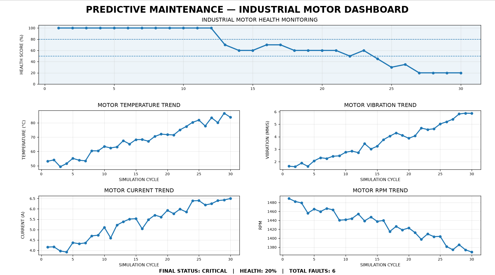

# ⚙️ Predictive Maintenance Simulator

### 🔧 Software-Based Industrial Motor Health Monitoring & Fault Detection

<p align="center">
  <b>SIMULATE → MONITOR → DETECT → PREDICT → MAINTAIN</b>
</p>

<p align="center">
  
  
  
  
  
  
</p>

---


## 🚀 Project Overview

**Predictive Maintenance Simulator** is a Python-based software simulation designed to demonstrate how industrial machines can be monitored for abnormal operating conditions and potential maintenance requirements.

Instead of using physical sensors, the system generates **simulated motor sensor data** and analyzes the machine condition over multiple operating cycles.

The simulator monitors four important motor parameters:

| Parameter | Unit | Purpose |
|---|---:|---|
| 🌡️ Temperature | °C | Detect overheating |
| 📳 Vibration | mm/s | Detect mechanical abnormalities |
| ⚡ Current | A | Detect electrical overload |
| 🔄 RPM | RPM | Monitor motor speed |

The collected data is processed to calculate a **Machine Health Score**, identify faults, determine severity, generate maintenance recommendations, store data, and visualize machine condition through a monitoring dashboard.

> **Note:** This is a software simulation/prototype. No physical motor or sensors are required.

---


# 🎯 Project Objective

The main objective of this project is to demonstrate the basic workflow of an industrial predictive-maintenance system using Python.

The system follows:

```text
Sensor Simulation
       ↓
Data Processing
       ↓
Health Monitoring
       ↓
Fault Detection
       ↓
Severity Classification
       ↓
Maintenance Recommendation
       ↓
Data Logging
       ↓
Monitoring Dashboard


✨ Key Features
📡 Sensor Data Simulation
Simulates industrial motor parameters without requiring physical hardware.
- 🌡️ Temperature
- 📳 Vibration
- ⚡ Current
- 🔄 RPM
The simulator introduces gradual motor degradation to represent changing machine conditions.


🧠 Machine Health Score
The system calculates a machine health score based on sensor conditions.
100% ───────── Healthy
 80% ───────── Normal
 50% ───────── Warning
  0% ───────── Critical

The health score decreases when abnormal sensor conditions are detected.


🚨 Fault Detection
The system detects abnormal operating conditions and assigns severity levels.
Example:
🟡 WARNING: HIGH TEMPERATURE

🔴 CRITICAL: OVER TEMPERATURE

🟡 WARNING: HIGH VIBRATION

🔴 CRITICAL: EXCESSIVE VIBRATION

🟡 WARNING: HIGH CURRENT

🔴 CRITICAL: OVER CURRENT

🟡 WARNING: LOW RPM

🔴 CRITICAL: LOW RPM


🛠️ Maintenance Recommendations
Based on the machine condition, the system generates recommendations.
NORMAL
→ Continue normal operation

WARNING
→ Schedule maintenance inspection

CRITICAL
→ Stop machine and perform maintenance


📊 Fault Statistics
After the simulation, the system summarizes detected faults.
================================
         FAULT STATISTICS
================================

Total Faults Detected : XX
Critical Faults       : XX
Warning Faults        : XX

================================


💾 Automatic Data Logging
Sensor readings and machine analysis are automatically stored in:
data/motor_sensor_data.csv

The stored data includes:
- Simulation cycle
- Temperature
- Vibration
- Current
- RPM
- Health score
- Machine status
- Recommendation
- Detected faults


📈 Monitoring Dashboard
The project generates a multi-graph monitoring dashboard.
┌──────────────────────────────────────────────┐
│             HEALTH SCORE TREND               │
├────────────────────────┬─────────────────────┤
│   TEMPERATURE TREND    │   VIBRATION TREND   │
├────────────────────────┼─────────────────────┤
│      CURRENT TREND     │      RPM TREND      │
└────────────────────────┴─────────────────────┘

The dashboard helps visualize how machine parameters change as the simulated motor gradually degrades.


🏗️ Project Architecture
Predictive-Maintenance-Simulator/
│
├── 📁 data/
│   └── 📄 motor_sensor_data.csv
│
├── 📁 src/
│   ├── 🐍 main.py
│   ├── 🐍 sensor_simulator.py
│   ├── 🐍 health_monitor.py
│   └── 🐍 fault_detector.py
│
├── 📄 .gitignore
└── 📄 README.md


🔍 Module Description
File	Responsibility
sensor_simulator.py	Generates simulated motor sensor data
health_monitor.py	Calculates machine health score and status
fault_detector.py	Detects abnormal conditions and fault severity
main.py	Runs the complete simulation and dashboard
motor_sensor_data.csv	Stores generated sensor data


⚙️ How It Works
For every simulation cycle, the system performs the following operations:
1️⃣ Generate sensor readings
        ↓
2️⃣ Calculate machine health
        ↓
3️⃣ Detect abnormal conditions
        ↓
4️⃣ Classify fault severity
        ↓
5️⃣ Generate maintenance recommendation
        ↓
6️⃣ Store sensor data
        ↓
7️⃣ Update monitoring dashboard

The simulated motor gradually degrades as the simulation progresses, allowing the system to demonstrate condition monitoring and fault detection.


🖥️ Technologies Used
Programming
- 🐍 Python
Data Processing
- NumPy
- Pandas
Data Visualization
- Matplotlib
Development Tools
- Visual Studio Code
- Git
- GitHub


📦 Installation
1. Clone the Repository
git clone https://github.com/veerunad021-prog/Predictive-Maintenance-Simulator.git

2. Open the Project
cd Predictive-Maintenance-Simulator

3. Create a Virtual Environment
python -m venv venv

4. Activate the Virtual Environment
Windows
venv\Scripts\activate

5. Install Required Libraries
pip install -r requirements.txt


▶️ Running the Project
Run the main simulation using:
python src/main.py

The program will:
- Generate sensor readings
- Calculate machine health
- Detect faults
- Classify fault severity
- Generate maintenance recommendations
- Save sensor data
- Generate the monitoring dashboard


📊 Example System Output
================================
  PREDICTIVE MAINTENANCE SYSTEM
================================

--- Cycle 1 ---

Temperature    : 49.82 °C
Vibration      : 1.42 mm/s
Current        : 3.91 A
RPM            : 1486.21
Health Score   : 100%
Machine Status : NORMAL
Recommendation : Continue normal operation

As the simulated motor degrades:
--- Cycle XX ---

Temperature    : 74.62 °C
Vibration      : 4.91 mm/s
Current        : 6.32 A
RPM            : 1342.15
Health Score   : 55%
Machine Status : WARNING
Recommendation : Schedule maintenance inspection

FAULT ALERTS:

🟡 WARNING: HIGH TEMPERATURE
🟡 WARNING: HIGH VIBRATION
🟡 WARNING: HIGH CURRENT


📈 Predictive Maintenance Concept
Traditional maintenance often follows a fixed schedule:
Time-Based Maintenance
        ↓
Maintenance at fixed intervals

This project demonstrates a condition-based approach:
Sensor Data
     ↓
Machine Condition
     ↓
Fault Detection
     ↓
Health Assessment
     ↓
Maintenance Decision

This concept can be extended in future versions to use real sensor data and machine-learning models.


🔮 Future Improvements
The current simulator can be expanded into a more advanced predictive-maintenance platform.


🤖 Machine Learning
Train machine-learning models using historical sensor data to predict possible machine failures.


🔌 Real Sensors
Connect actual sensors using:
- Arduino
- ESP32
- Raspberry Pi
Possible sensors include:
- Temperature sensor
- Accelerometer
- Current sensor
- RPM sensor


## 📊 Project Dashboard




🌐 Real-Time Monitoring
Add live sensor streaming and continuous machine monitoring.


🖥️ Web Dashboard
Create an interactive web-based dashboard using:
- Flask
- Streamlit
- Plotly


🗄️ Database Integration
Store long-term machine data using:
- SQLite
- MySQL
- PostgreSQL


⏳ Remaining Useful Life
Future versions can estimate:
Remaining Useful Life (RUL)

of the machine using historical operating data.


🎓 Engineering Concepts Demonstrated
This project combines concepts from:
- Embedded Systems
- Industrial Automation
- Sensor Monitoring
- Condition Monitoring
- Fault Detection
- Predictive Maintenance
- Python Programming
- Data Processing
- Data Visualization
It provides a software foundation that can later be integrated with embedded hardware, real sensors, IoT systems, and machine learning.


⚠️ Important Note
This project is a software simulation/prototype.
It does not directly measure a physical motor and does not claim to predict real-world equipment failure.
The sensor values are simulated to demonstrate the workflow of an industrial predictive-maintenance system.


👨‍💻 Author
Veeresh N Achar
Electronics & Communication Engineering
Areas of Interest
Embedded Systems • Robotics & Automation • Industrial Automation • Python • Predictive Maintenance


## 🚀 Project Status

**Version:** 1.0.0  
**Status:** Completed & Tested ✅  
**Platform:** Windows / Python  
**Type:** Software-based Predictive Maintenance Simulation

The simulator is fully functional and available on GitHub with source code, documentation, dependency configuration, and dashboard visualization.